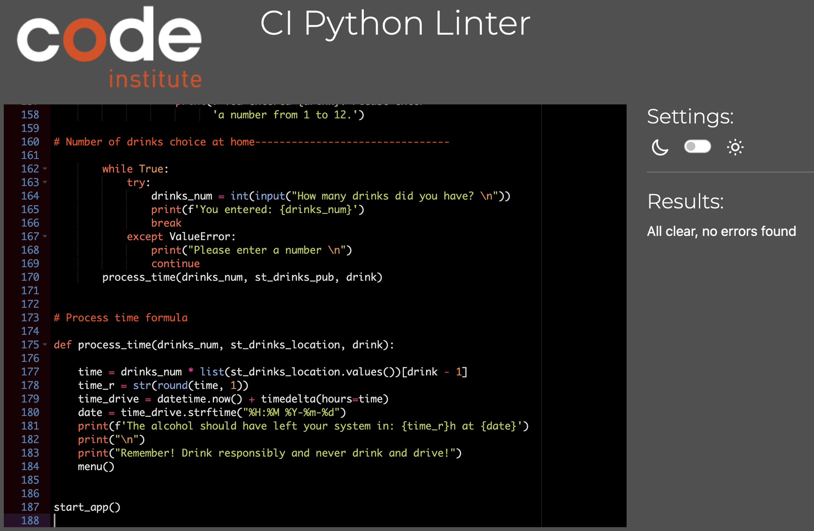

<h1>Drink and Drive Calculator</h1>

This project introduces an interactive application that calculates an estimated time
of processing alcohol for information purposes only. This application allows users to chooce the place the were drinking in (pub or home), the drink itself and the number of drinks. After that the application shows the time when the alcohol should have left the users system.

Target audience: all age groups from 18, as "You must be 18 or over to buy alcohol in Ireland". Especially those who own and/or drive a car, as the app shows when the user will be able to drive after drinking.

* The application can be found [here](https://drinks-calculator.herokuapp.com)
* The repository can be found [here](https://github.com/Sergutin/DrinkDriveCalculator)

* [Languages Used](#languages-used)
* [Features](#features)
  * [Run Programm](#run-programm)
  * [Drink place input](#drink-place-input)
  * [Pub Drinks](#pub-drinks)
  * [Home Drinks](#home-drinks)
* [Testing](#testing)
  * [CI Python Linter](#CI-Python-Linter)
  * [Fixed Bugs](#fixed-bugs)
  * [Unfixed Bugs](#unfixed-bugs)
* [Deployment](#deployment)
  * [Cloning and forking](#cloning-and-forking)
* [Media](#media)

## Languages Used

Python

## Features

  ### Run Programm

When the users run the application, a welcome message with a brief description appears.
It explains what the tool does and how it works in general.

  ### Drink Place Input

After the welcome message users are invited to start the application by answering the first question: 
"Where were you Drinking: pub / home?".

The only acceptable inputs in this field are "pub" or "home". If the users enter anything but "pub" or "home", they will see
a message: "Please use "pub" or "home" to reply"

  ### Pub Drinks

If users enter "pub", they see a list of drinks available. They will be offered to enter a number of drinks from the list to pick the one the were drinking.

As there are 13 drinks in this list, only numbers from 1 to 13 accepted as users input. If users enter anything but these numbers, they will see a message "Please enter a number from 1 to 13":

After they entered a correct number from the list, they will be asked to enter the amount of drinks they had: "How many drinks did you have?"

Numbers only are accepted in this users input as well. If the users enter anything else they will see a message "Please enter a number":

When users enter a number of drinks, they will see a message stating in how many hours the alcohol should have left their system.
Additionally the users will be provided with a specific date and time of when the process will be finalised (counting from the current minute):

After the final statement users are offered to start application again by replying "y" or "n". Only these answers are accepted as the inputs and users will see "Please use "y" or "n" to reply" in case they do not follow it:

If users want to start again and enter "y", they will see the first question and the application starts from the beginning:

  ### Home Drinks

If the users use "home" as a drink location rather than "pub", they will be offered a list of drinks available for home menu (which is different than the one for pub):

The same input rules here in place, only numbers from 1 to 12 are accepted as input (as there are 12 drinks in the list).
If the users enter anything different than that, they will see a message "Please enter a number from 1 to 12":

The next steps are the same as for "pub" path, users enter a number of drinks, then they see a final message with a date and time of when the alcohol should have left their suystem. As the last question they will be offered to start the application again:

## Testing

  ### CI Python Linter 

No errors were returned when passing through the PEP8 CI Python Linter:

  ### Fixed Bugs

During the project there were a few bugs and errors that have been fixed.

<ul>
<li>Bug Number One: "You Win" window appeared every time after 2 matching pairs (for "easy" and for "normal" game as well, while for "normal" game it supposed to appear after 8 matching pairs rather than 2).</li>

Solution: JavaScript function matchCards was amended from:

to:

Additionally a global variable "level" was added with a default value of "null". It helped to solve the issue.

<li>Bug Number Two: Shuffle function didn't work properly for easy game, it was taking random cards from the whole array (8 cards) rather than from the first two cards.</li>

Solution: "shuffleCard" function was moved from "matchCard" function to the very beginning of the game, when users decide which game to play (easy / normal). Code with a bug:

Code after the fix:

<li>Bug Number Three: Last four images in Normal game were not visible, just alt description was available.</li>

Solution: forEach function (within shuffleCard function) was trying to run through all the cards, including the ones were hidden (when "Normal" game is being played, "Easy" game cards are being hidden). Another function "shuffleEasyCard" was implemented to separate cards for "normal" game and the ones for "easy" game. It solved the issue.

</ul>

  ### Unfixed Bugs

There are no known unfixed bugs in the code

## Deployment

The site is deployed using GitHub Pages.

To deploy the site using GitHub Pages:

<ol>
<li>Login or signup to Github.</li>
<li>Go to the repository for this project, https://github.com/Sergutin/CardMemoryGame</li>
<li>At the top of the repository, locate the "Settings" button on the menu.</li>
<li>Select "Pages" section in the left hand menu.</li>
<li>From the "Source" dropdown select "Deploy from a Branch". Press "Save".</li>
<li>The site has now been deployed, please note that the process may take a few minutes before the site goes live.</li>
</ol>

  ### Cloning and forking

Forking a repository creates a copy of the original repository on GitHub account.
To fork a repository in GitHub:

<ol>
<li>On GitHub.com, navigate to the repository.</li>
<li>In the top-right corner of the page, click Fork.</li>

<li>Select an owner for the forked repository.</li>
<li>By default, forks are named the same as their parent repositories. You can change the name of the fork to distinguish it further.</li>
<li>Optionally, add a description of your fork.</li>
<li>Choose whether to copy only the default branch or all branches to the new fork. For many forking scenarios, such as contributing to open-source projects, you only need to copy the default branch. By default, only the default branch is copied.</li>
<li>Click Create fork.</li>
</ol>

Cloning a repository creates a copy of the original repository on our local machine.
To clone a repository in GitHub:

<ol>
<li>On GitHub.com, navigate to your fork of the repository.</li>
<li>Above the list of files, click  Code.</li>

<li>Copy the URL for the repository.</li>
<ul>
    <li>To clone the repository using HTTPS, click the "Copy" icon on the right of "HTTPS".</li>

<li>To clone the repository using an SSH key, including a certificate issued by your organization's SSH certificate authority, click SSH, then click the icon on the right to copy it.</li>
  <li>To clone a repository using GitHub CLI, click GitHub CLI, then click the "Copy" icon on the right.</li>
</ul>
</ol>

## Media

Standard drinks information was taken from https://www.drugs.ie/site/screen2StandardDrinks.html, https://www.drinkaware.ie/what-is-a-standard-drink/ and https://www.nhs.uk/live-well/alcohol-advice/calculating-alcohol-units/

